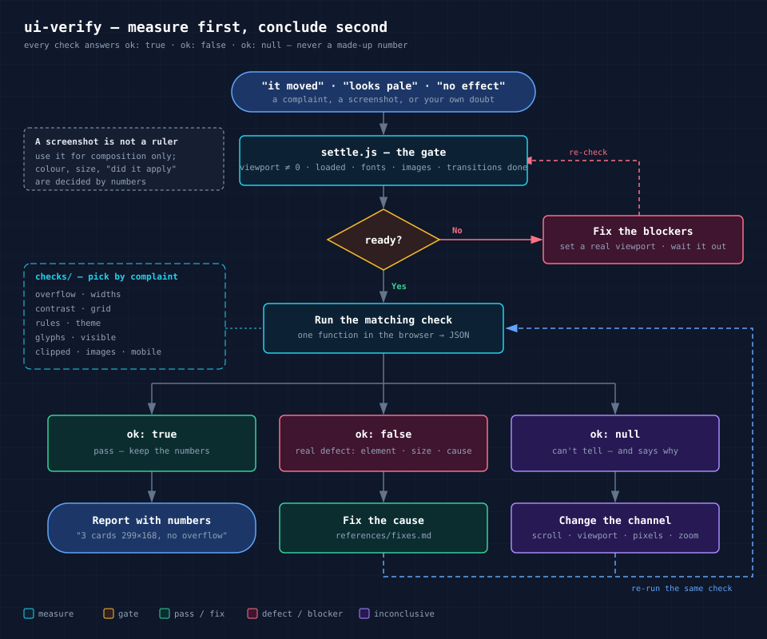
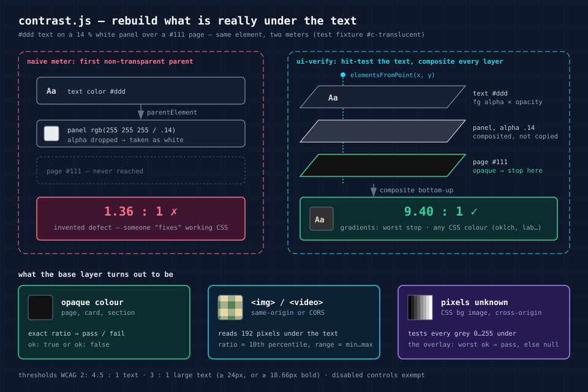
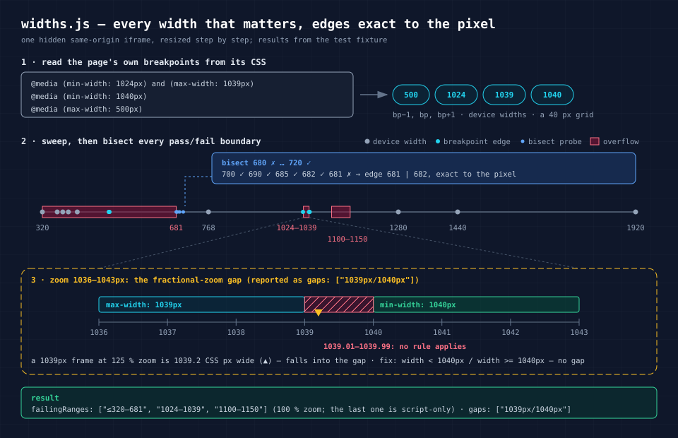

# ui-verify

**Мерить страницу, а не верить скриншоту.** Скилл для ИИ-агентов, которые
пишут вёрстку, и одновременно набор обычных браузерных функций для людей.
Он проверяет вёрстку числами: что торчит вбок и почему, какой на самом деле
контраст текста на фоне, почему разъехались карточки, какое CSS-правило
победило, как переключается тема, есть ли нужный символ в шрифте, не
закрыт ли элемент соседом, не обрезан ли текст, всё ли в порядке с
картинками и мобильной версией — и так на каждой ширине между брейкпоинтами.

[English version](README.md)

## Зачем

Агент смотрит на скриншот, не видит изменения и «чинит» CSS, который
работал. Или видит бледную ссылку, которая бледная только потому, что
картинку пережали. Скриншот теряет малоконтрастные детали и может быть снят
раньше, чем страница дорисовалась. Отсюда два правила, на которых держится
скилл.

Первое: **положительный результат надёжен, отрицательный — нет.** «Вижу» —
факт, «не вижу» — вопрос.

Второе: **уверенное число — тоже всего лишь канал измерения.** Наивный
замер контраста показывает 1.36 : 1 там, где на самом деле 9.4 : 1, и
кто-нибудь идёт это «исправлять».

Поэтому каждая проверка работает внутри страницы, меряет то, что браузер
реально посчитал, и отвечает в трёх состояниях: `ok: true`; `ok: false` с
элементом, цифрами и причиной; или `ok: null` с объяснением, почему ответа
нет. Где проверка не уверена (эффект, который она не умеет считать, картинка,
пиксели которой нельзя прочитать), она так и говорит, а не подставляет
выдуманное число. И каждый ответ перечисляет, что именно было проверено,
поэтому `true` не читается шире, чем он есть.



## Что проверяет

| Проверка | Что ловит |
|---|---|
| `settle` | замер раньше времени: нулевой вьюпорт скрытой панели, недогруженные шрифты и картинки, идущие анимации, файлы с 404 |
| `overflow` | страница ездит вбок — самый внешний виновник, причина и вложенный элемент, который его распирает |
| `widths` | дефекты между брейкпоинтами: берёт `@media` из CSS самой страницы, проходит по ним и бинарным поиском находит границу до пикселя; ловит «щель» при дробном масштабе |
| `contrast` | контраст по WCAG относительно того, что реально под текстом: полупрозрачные слои, градиенты, соседние блоки, **пиксели фотографии**; любые цвета CSS, включая `oklch()` и `color-mix()` |
| `grid` | карточки и обложки разного размера; указывает на распирание из-за `min-width: auto` |
| `rules` | «правило не применилось»: все подходящие правила с контекстом `@media`, `@layer`, `@supports`, активно ли оно сейчас, специфичность и вероятный победитель |
| `theme` | механизм темы (класс, `data-theme`, `data-bs-theme`, медиазапрос); переключение туда и обратно — какие цвета не вернулись или застыли из-за `transition` |
| `glyphs` | символы, которые рисует запасной шрифт: стрелки, галочки, знаки валют |
| `visible` | «по цифрам всё хорошо, а на экране пусто»: перекрыт соседом, обрезан `overflow`, прозрачен, за экраном — и доходит ли до него клик |
| `clipped` | текст, обрезанный `overflow: hidden` или вылезший из кнопки или карточки; многоточие, `line-clamp` и `.sr-only` дефектом не считает |
| `images` | битые, растянутые, мыльные для плотности экрана, слишком тяжёлые, без `width`/`height`, без `alt` |
| `mobile` | мета-тег viewport, текст мельче 12px, поля ввода мельче 16px (iOS увеличивает страницу), зоны нажатия меньше 24×24 с исключениями из WCAG 2.2 |

К каждому ответу есть рецепт исправления в
[`references/fixes.md`](skills/ui-verify/references/fixes.md) (на английском).

### Контраст, который не врёт



Проверка находит точку под каждой строкой текста, проходит по всем слоям
под ней, а не только по родителям, и складывает их обратно — с учётом
прозрачности предков и цветов *между* точками градиента. Если под текстом
картинка или видео с того же домена, она читает настоящие пиксели —
примерно по одному на CSS-пиксель — и ставит «проходит», только если
проходит каждый из них. Если пиксели узнать нельзя (фон через CSS, картинка
с чужого домена), она считает границу для любого цвета под текстом (точную
для непрозрачного текста): если проходит даже худший случай, затемнение
гарантирует читаемость; если нет — ответ `inconclusive` с диапазоном, а не
придуманная цифра. Фильтры, режимы наложения и крупные оверлеи `::before`,
которые формула не моделирует, тоже дают `inconclusive` — с оценкой.

### Все важные ширины, а не два пресета



## Установка

**Claude Code, как плагин:**

```bash
claude plugin marketplace add itpartypattaya/ui-verify
```

```bash
claude plugin install ui-verify@ui-verify
```

Или внутри сессии: `/plugin marketplace add itpartypattaya/ui-verify`, затем
`/plugin install ui-verify@ui-verify`.

**Claude Code, только скилл:** скопируйте папку `skills/ui-verify` в
`~/.claude/skills/` (для всех проектов) или в `.claude/skills/` (для одного).

**Другие агенты**, которые понимают скиллы в формате `SKILL.md`: та же папка
в их каталог скиллов. Проверено на Claude Code; сами проверки — обычный
JavaScript для полноценного контекста страницы. В ограниченных контекстах,
включая Codex In-app Browser, сначала запустите `checks/capabilities.js`;
недоступные проверки вернут `ok: null` с перечнем отсутствующих API. Подробности
в [адаптерах браузеров](skills/ui-verify/references/adapters.md).

**Без агента:** файлы в `skills/ui-verify/checks/` — самостоятельные функции.
Вставьте любую в консоль DevTools или вызывайте из тестов Playwright,
Puppeteer, Cypress — см.
[`references/adapters.md`](skills/ui-verify/references/adapters.md).

## Как пользоваться

Скилл срабатывает сам, когда агент собирается сделать вывод о вёрстке по
скриншоту. Можно попросить и напрямую:

- «Карточки тарифов на планшете разной высоты — проверь через ui-verify».
- «Прогони ui-verify на localhost:4321 на 375 и 1280 px».
- «Какой контраст у заголовка на фотографии в первом экране?»
- «Проверь вёрстку на телефоне: что-то ездит вбок».

Так выглядит отчёт агента после проверки:

> На 1030 px страница шире экрана на 109 px: `div.o-band` шириной 1100 px
> внутри секции 1015 px (фиксированная ширина из `@media (min-width: 1024px)
> and (max-width: 1039px)`). Бинарный поиск дал точный диапазон поломки:
> 1024–1039 px. Исправление: `max-width: 100%` у `.o-band`, затем повторить
> `widths`.

## Как проверено

`test/fixtures.html` — страница, где на каждую проверку есть намеренный
дефект и рядом здоровый контрольный элемент: цвет в `oklch` на фоне
`color-mix()`, карусель, которая *не должна* считаться переполнением,
многоточие, которое *не должно* считаться обрезанным текстом, баг темы,
урезанный шрифт без `→` и `€`. `test/index.html` запускает все проверки на
нужной ширине и сверяет и то, что должно найтись, и то, что не должно:
**88 из 88 в Chrome 154**. Сохранены все 66 прежних кейсов, включая 31
регрессию по двум независимым ревью версии 1.0 (Codex и Antigravity);
добавлены 22 кейса для ограниченных контекстов и обработки недоступных API.
Адаптер Codex In-app Browser также проверен в его реальном read-only
контексте: недоступные режимы возвращают неопределённый результат.
Запустить самому:

```bash
python -m http.server 8000
```

и открыть `http://localhost:8000/test/`.

Проверки прогнаны и на живом сайте в продакшне (Astro, цвета в oklch,
первый экран с фотографией) — чтобы поймать ложные срабатывания. Найденные
там (skip-ссылка под `overflow-x: clip`, «таблетки» в футере, ширина
которых задаётся текстом) исправлены и закреплены тестами.

По ходу набор тестов поймал две особенности самого браузера, и теперь
проверки о них сообщают. При масштабе Windows 125 % вьюпорт в 1039 px на
деле равен 1039.2 CSS px, и мимо него проходят и `max-width: 1039px`, и
`min-width: 1040px` (`widths` → `gaps`). А Chromium 152 не обновляет цвет со
`transition`, если значение приходит из `light-dark()` и меняется
`color-scheme` (`theme` → `stale`).

## Чего не делает

Не оценивает композицию, ритм и вкус — это по-прежнему работа скриншота и
ваших глаз. Не заменяет полный аудит доступности (для этого есть axe-core),
не сравнивает скриншоты попиксельно и не меряет скорость. Не заходит в
Shadow DOM и iframe (даже со своего домена). `widths` проверяет каждые 40 px
плюс края всех брейкпоинтов — более узкий островок поломки, о котором не
говорит ни один брейкпоинт, может проскочить. Контраст считается по WCAG 2.x, не по
APCA.

## Лицензия

[MIT](LICENSE)
